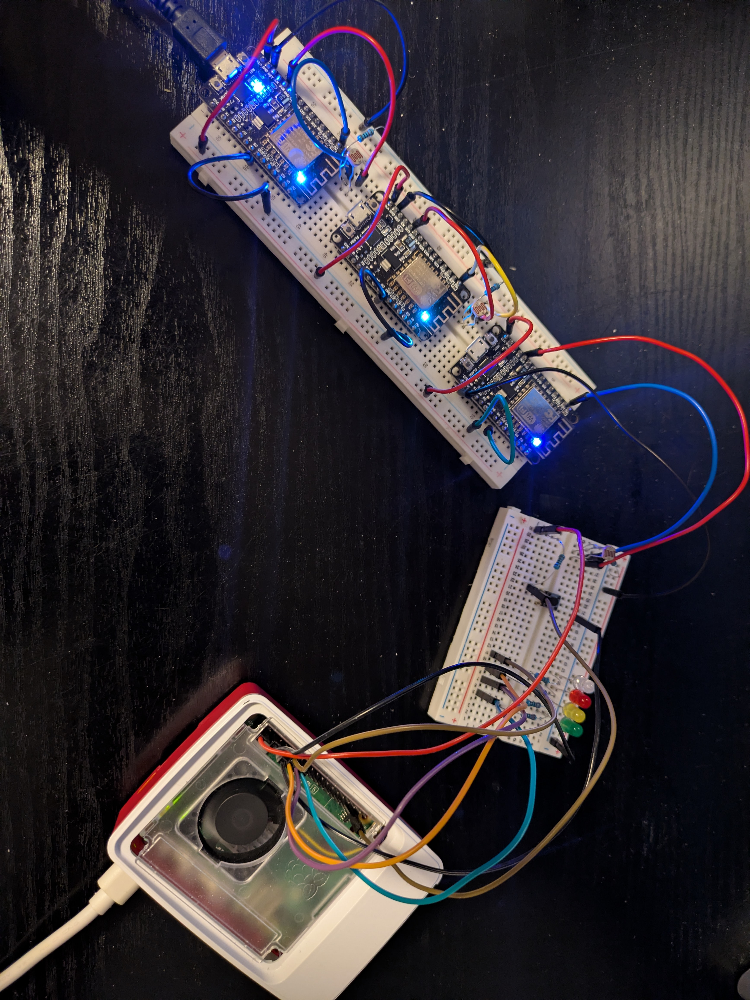

# Raspberry Pi – ESP8266 UDP Light Swarm System

## Overview

This project implements a distributed, real-time light sensing system using a **swarm of ESP8266 NodeMCU devices** and a **Raspberry Pi**.

Each ESP8266 node measures ambient light using an analog photoresistor and broadcasts its readings using **UDP broadcast**.  
All ESP8266 nodes run identical firmware and autonomously coordinate to determine which node has the highest light reading.

The ESP8266 with the highest reading automatically becomes the **Master**.  
Only the Master forwards its data to the Raspberry Pi.

The Raspberry Pi acts as:
- A real-time data logger
- A visual feedback controller using LEDs
- A reset controller using a physical button

The system supports **1 to 3 ESP8266 devices dynamically**, without requiring code changes.

No IP addresses are hard-coded anywhere in the system.

---

## Key Features

- Fully decentralized ESP8266 swarm
- Automatic Master election based on sensor readings
- UDP broadcast communication only
- Dynamic join and leave of ESP8266 nodes
- Real-time LED visualization on Raspberry Pi
- Physical reset button with full system reset
- Persistent logging of sensor data
- Implemented in **C++ (ESP8266)** and **Rust (Raspberry Pi)**

---

## Hardware

### Raspberry Pi
- Raspberry Pi (any model with GPIO support)
- 1 × momentary push button
- 4 × LEDs with current-limiting resistors
  - White LED (system reset indicator)
  - 3 × LEDs (one per ESP8266)
- Breadboard and jumper wires

### ESP8266
- ESP8266 NodeMCU (1 to 3 devices)
- Photoresistor (analog light sensor)
- Resistor for voltage divider
- Uses built-in LEDs:
  - GPIO2: sensor activity indicator
  - GPIO16: Master indicator

---

## Wiring

### Raspberry Pi
- Button connected between GPIO26 and GND
- White LED connected to GPIO18 through resistor
- Three LEDs connected to GPIO17, GPIO22, GPIO27 through resistors
- All LED cathodes connected to GND

### ESP8266
- Photoresistor connected as a voltage divider to A0  
  - 3.3V → photoresistor → A0 → resistor → GND
- Built-in LED on GPIO2 used for brightness indication
- Built-in LED on GPIO16 used for Master indication

## Hardware Setup

### ESP8266 and Raspberry Pi Setup



---

## Network Configuration

- Communication protocol: UDP
- Port: `4210`
- Broadcast address: `255.255.255.255`
- All devices must be on the same WiFi network
- No IP addresses are hard-coded
- ESP8266 nodes and Raspberry Pi discover each other dynamically

---

## Program Description

### ESP8266 Program Behavior

Each ESP8266 device runs the same firmware and behaves as follows:

#### Startup State
- Connects to WiFi
- Initializes UDP socket
- Turns OFF both built-in LEDs
- Initializes internal swarm table
- Assumes Master role temporarily until other nodes are discovered

---

#### Sensor Sampling and LED Feedback
- Reads analog light sensor from A0
- Uses a linear mapping to convert brightness into blink speed
- Built-in LED on GPIO2 flashes continuously
  - Higher brightness results in faster blinking
  - Lower brightness results in slower blinking

---

#### ESP8266 Swarm Communication
- Each ESP8266 broadcasts its reading when the network is silent for 200 ms
- Message format:
```
- Each node stores the most recent readings from other swarm members
- Swarm IDs are derived dynamically from the device’s IP address

---

#### Master Election Logic
- After broadcasting, each ESP8266 compares its reading with others
- If another node has a strictly higher reading, the device becomes a non-Master
- If no other node has a higher reading, the device becomes the Master

---

#### Master Behavior
- Turns ON the second built-in LED (GPIO16)
- Broadcasts data to the Raspberry Pi using:
```
+++Master,<swarm_id>,<reading>***
```
- Non-Master nodes do not send data to the Raspberry Pi

---

#### Reset Handling
- ESP8266 listens for reset messages from Raspberry Pi
- Upon receiving reset:
- Turns OFF both LEDs
- Clears swarm state
- Resets timing and readings
- Waits for swarm to re-form

---

### Raspberry Pi Program Behavior

The Raspberry Pi program is implemented in Rust and consists of two logical threads:
- A UDP processing thread
- A GPIO control thread

---

#### Startup State
- All LEDs are OFF
- UDP socket binds to port 4210
- Log file `sensor_readings.txt` is preserved until reset
- No Master is assumed initially

---

#### Receiving ESP8266 Data
- Raspberry Pi listens for UDP broadcast packets
- Accepts only properly formatted Master packets:
```
+++Master,<swarm_id>,<reading>***
```
- Ignores non-Master and reset packets

---

#### LED Assignment and Visualization
- Each ESP8266 is assigned one LED dynamically
- Assignment persists until reset
- Only ONE LED blinks at a time, representing the current Master
- Blink speed corresponds to brightness:
- Higher brightness → faster blinking
- Lower brightness → slower blinking

---

#### Terminal Output
- Displays timestamped status messages
- Logs Master changes
- Prints periodic status updates including:
- Master ID
- Sensor reading
- Blink interval

---

#### Data Logging
- Every valid Master reading is appended to:
```
sensor_readings.txt
```
- Format:
```
Swarm ID <id>: <reading>
```

---

#### Reset Button Behavior
When the physical button is pressed:

1. Raspberry Pi broadcasts:
 ```
 +++RESET_REQUESTED***
 ```
2. White LED turns ON for 3 seconds
3. All RGB LEDs turn OFF
4. Log file is cleared
5. Internal state is reset
6. ESP8266 swarm re-initializes automatically

---

## UDP Message Formats

### ESP8266 → ESP8266
```
~~~<swarm_id>,<reading>---
```

### ESP8266 (Master) → Raspberry Pi
```
+++Master,<swarm_id>,<reading>***
```

### Raspberry Pi → ESP8266 (Reset)
```
+++RESET_REQUESTED***
```

---

## Project Structure

```
lightswarm-udp-iot-esp8266-raspberrypi/
├── esp8266/
│   ├── src/
│   │   └── main.cpp
│   ├── platformio.ini
│   └── README.md
├── raspberrypi/
│   ├── src/
│   │   └── main.rs
│   ├── Cargo.toml
│   └── README.md
├── sensor_readings.txt
└── README.md
```

---

## Build and Run

### ESP8266
1. Open project in PlatformIO
2. Select NodeMCU ESP8266 board
3. Configure WiFi credentials
4. Upload firmware to 1–3 ESP8266 devices

### Raspberry Pi
1. Install Rust toolchain
2. Build and run:
 ```bash
 cargo run
 ```

---

## Expected Results

- ESP8266 devices dynamically form a swarm
- The brightest ESP8266 becomes Master automatically
- Only one ESP8266 communicates with Raspberry Pi at a time
- Raspberry Pi LEDs visualize the active Master
- Blink speed reflects real-time light intensity
- Reset button cleanly restarts the entire system
- System operates correctly with 1, 2, or 3 ESP8266 nodes

---

## Author

Pham Kim Quy  
Distributed Systems and Embedded Networking Project
